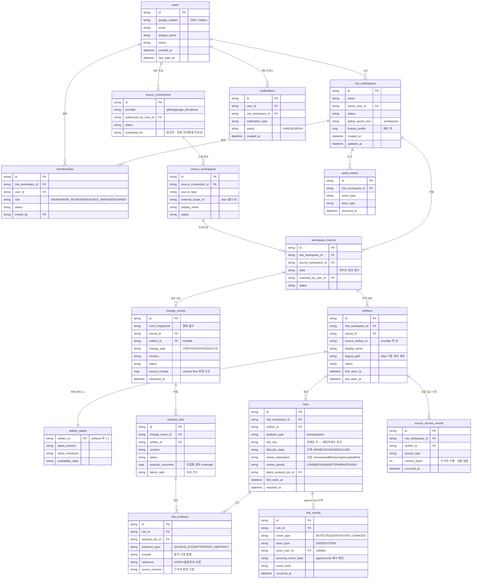

# IP RISK — Firestore 컬렉션 vs Dataclass 구분 정리

## 1. Firestore 컬렉션 16개 ↔ 저장되는 dataclass 17종

| # | 컬렉션 (schema.py) | record_kind | 저장되는 dataclass (정의 위치) | 무엇인가 |
|---|---|---|---|---|
| 1 | `users` | `user` | `User` — core/auth/models.py | OIDC 로그인 사용자 |
| 2 | `risk_workspaces` | `risk_workspace` | `RiskWorkspace` — core/workspaces/models.py | 격리 경계. `.ipriskignore` 원문·정책 버전 보유 |
| 3 | `memberships` | `membership` | `Membership` — core/memberships/models.py | 멤버 + 역할(RBAC 4종) |
| 3′ | `memberships` (같은 컬렉션) | `membership_invitation` | `MembershipInvitation` — core/memberships/models.py | 초대장. record_kind 로 구분 |
| 4 | `source_connections` | `source_connection` | `SourceConnection` — core/mounts/models.py | provider 권한 연결. `credential_ref` 는 참조만 |
| 5 | `source_workspaces` | `source_workspace` | `SourceWorkspace` — core/mounts/models.py | 연결이 노출하는 범위(repo·폴더) |
| 6 | `workspace_mounts` | `workspace_mount` | `WorkspaceMount` — core/mounts/models.py | 경계에 붙인 마운트. `alias` 가 게이트 경로 접두 |
| 7 | `artifacts` | `artifact` | `Artifact` — core/artifacts/models.py | 추적 파일의 정체성 (`logical_path`·`display_name`) |
| 8 | `artifact_states` | `artifact_state` | `ArtifactState` — core/artifacts/models.py | 파일당 1문서. 최신 revision·checksum·가용성 |
| 9 | `change_events` | `change_event` | `ChangeEvent` — application/process_change/models.py | 변경 신호 큐. fingerprint 중복 흡수·worker 임대 |
| 10 | `analysis_jobs` | `analysis_job` | `AnalysisJob` — application/analysis_jobs/models.py | 분석 실행 단위. 타입별 outcome 내장 |
| 11 | `risks` | `risk` | `Risk` — core/risk/models.py | 리스크 원장 본체. `risk_key` 가 정체성 |
| 12 | `risk_evidence` | `risk_evidence` | `RiskEvidence` — core/risk/models.py | 근거 발췌·출처. `source_revision` 으로 판본 고정 |
| 13 | `risk_events` | `risk_event` | `RiskEvent` — core/risk/models.py | append-only 이력. 해시 체인 |
| 14 | `audit_events` | `audit_event` | `AuditEvent` — core/audit/models.py | 워크스페이스 감사 이벤트 |
| 15 | `source_access_events` | `source_access_event` | `SourceAccessEvent` — core/audit/models.py | 원문 접근 기록 (바이트 수만, 내용 없음) |
| 16 | `notifications` | `notification` | `Notification` — core/notifications/models.py | 개인 인박스 알림 |

## 2. 문서 "안에" map 으로 내장되어 저장되는 dataclass (자기 컬렉션 없음)

컬렉션은 아니지만 위 문서들의 필드 값으로 직렬화되어 함께 저장된다.

| dataclass | 어느 문서 안에 | 필드 |
|---|---|---|
| `AnalysisOutcome` · `ProviderFailureSummary` | `analysis_jobs` | `analysis_outcomes` map |
| `LicenseDeploymentProfile` | `risk_workspaces` | `license_profile` |
| `SourceChange` (공유 계약, Pydantic) | `change_events` | `source_change` — content-free 변경 신호 |

## 3. 저장되지 않는 나머지 — 런타임 전용 타입의 분류

main 기준 backend 의 `@dataclass` 는 약 160개. 위 20여 개를 제외한 전부가 아래 범주의 **비영속** 타입이다.

| 범주 | 대표 예 | 역할 |
|---|---|---|
| 공유 계약 (shared/contracts) | `SourceSnapshot` · `SourceArtifactRef` · `AnalysisResult` · `Evidence` · `ReconcileResult` · `SourceAdapter` | Frozen Contract. **Pydantic StrictModel** 이라 dataclass 도 아님 — plane 간 통신 규약이며 그 자체는 저장 안 됨 (`SourceChange` 만 §2 로 내장 저장) |
| 계획(Plan) 값 객체 | `WorkspaceCreationPlan` · `InvitationPlan` · `RoleChangePlan` · `MountMutationPlan` · `MemberRemovalPlan` | 도메인 서비스가 "무엇을 쓸지" 계산한 결과. 실행되면 §1 문서로 반영되고 자신은 버려짐 |
| 판단·결정 결과 | `AuthorizationDecision` · `ExclusionDecision` · `LifecycleDecision` · `SecurityGateResult` · `CauseAttribution` · `VerdictFingerprint` | 게이트·권한·수명주기 판정의 반환값 |
| 커넥터 DTO | `DriveFile` · `DriveChange` · `GitHubRepository` · `GitHubCommit` · `FolderListing` | provider API 응답의 타입 표현. 게이트 통과 후 계약 타입으로 변환됨 |
| Intelligence 내부 표현 | `CachedClauseSearch` · `CachedDocument` · `ReferenceChunk` · `RankedCandidate` · `GroundedComparison` · `CorpusVersion` | RAG 파이프라인·캐시 표현. core Firestore 16개 컬렉션 밖에서 관리 |
| API 뷰 모델 | `RiskTimeline` · `HistoryEntry` · `HistoryExport` · `TrackedArtifactSummary` · `WorkspaceActivity` | §1 문서들을 읽어 화면용으로 합성한 읽기 전용 뷰 |
| 조립·설정 | `Settings` · `RuntimeContainer` · `GoogleCloudClients` · `IntelligenceConfig` · `*RouterDependencies` | 프로세스 기동 시 조립되는 구성. 데이터가 아님 |
| 영속 계층 내부 부품 | `CompositeIndex` · `DocumentKey` · `DocumentWrite` · `StoredDocument` | Firestore 접근을 기술하는 메타 타입. 저장 대상이 아니라 저장 "도구" |

